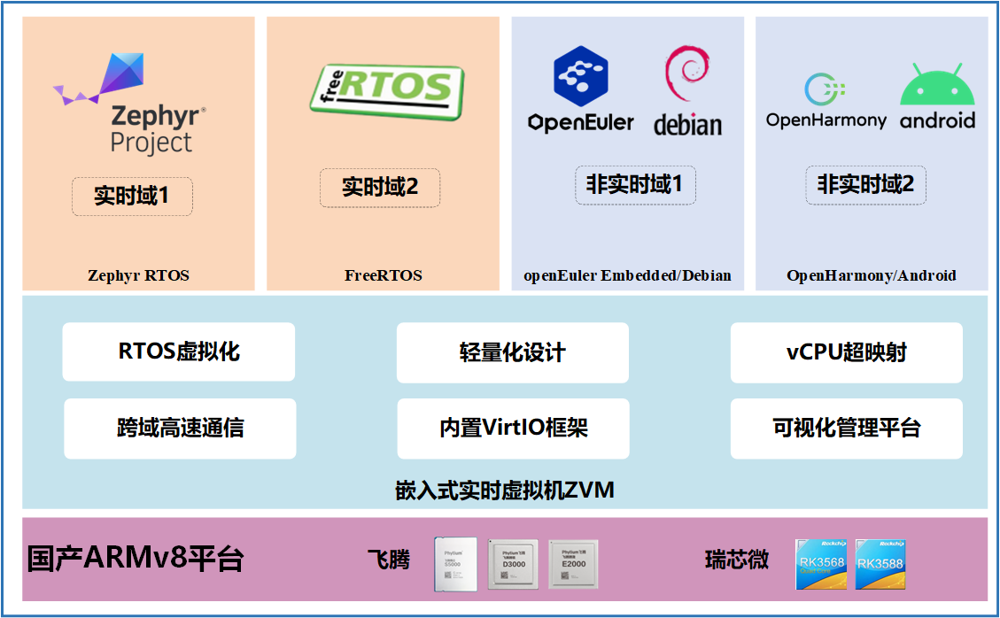
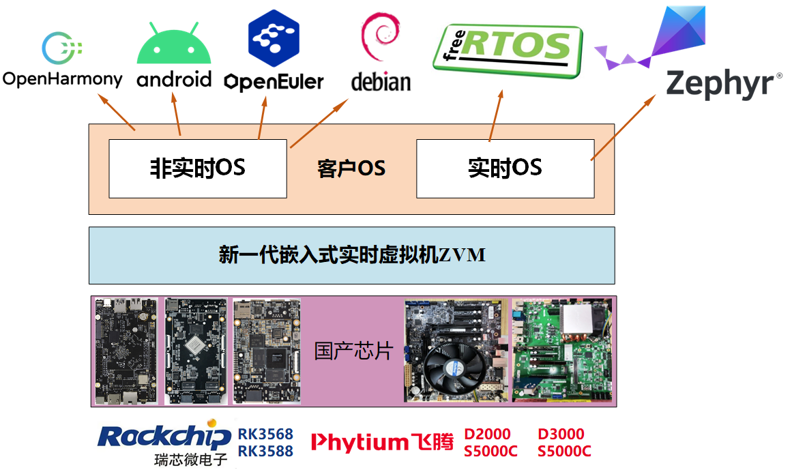
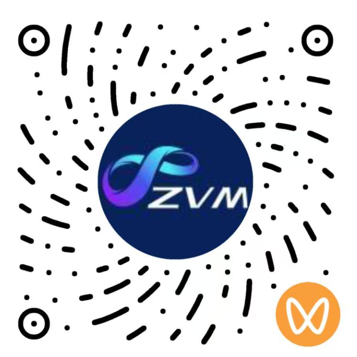

    

嵌入式实时虚拟机ZVM是一款基于开源RTOS内核的虚拟化产品，是面向嵌入式场景的实时Hypervisor，由湖南大学/长沙理工大学谢国琪教授主持开发，支持“一芯多域”混合部署，即在单颗芯片上同时运行多个隔离的功能域，每个域可独立承载客户操作系统（包括Linux、openEuler Embedded、 OpenHarmony、Android、Zephyr RTOS、FreeRTOS等）。

ZVM的主要特性如下：

1. **RTOS虚拟化：** ZVM作为裸金属Type 1硬实时Hypervisor，采用“RTOS内核+原生虚拟化”一体化架构，既提供强隔离与确定性，又复用Zephyr RTOS生态，实现Type 2 级的驱动与扩展。

2. **轻量化设计：** ZVM基础代码（RTOS内核+虚拟化）小于4万行，ZVM-RK3588发行版总代码量小于10万行，启动时间小于0.6秒，相较裸机平均延迟增幅<2%，性能损耗<1%。

3. **vCPU超映射：** 支持客户OS数量大于物理CPU核数。单个物理核可虚拟出多个vCPU，每个vCPU独占分配给一个客户OS；通过vCPU超映射机制，在有限核数上实现更多客户OS的混合部署。

4. **跨域高速通信：** 研制共享内存通信框架Zshm，支持单一客户OS同时向多个客户OS并发发送与接收消息。ZVM-RK3588发行版的跨域通信的平均端到端时延小于4微秒，具备高并发与低时延特性。

5. **内置VirtIO框架：** ZVM发行版集成VirtIO后端，支持virtio-net、virtio-blk等高效I/O虚拟化。可实现同一物理设备同时服务于多个客户OS，且保持低开销。ZVM-RK3588发行版的单个100 Mbps网卡通过VirtIO并发服务多个客户OS时，实测总网速可达92.9 Mbps。

6. **可视化管理平台VisualZVM：** ZVM发行版提供PC端可视化工具VisualZVM，与控制器端ZVM通过以太网连接，内置ZVM串口控制台，支持客户OS全生命周期管理与运行态动态监控。

6. **生态建设与兼容性：** ZVM作为openEuler根社区开源项目（Apache 2.0协议），获23年度优秀开源项目与24年度技术创新项目，完成了与瑞芯微RK3568/RK3588、飞腾E2000/D2000/D3000/S5000C等多款国产处理器的产品兼容性证明，推动了嵌入式实时虚拟机的国产化生态与技术创新发展。

## 架构设计

ZVM面向高性能嵌入式计算环境，提供嵌入式平台上操作系统级别的资源隔离和共享服务。可用于各种应用和行业领域，如智能装备、工业控制、汽车电子等。ZVM架构图如下所示：

## 持续集成

ZVM将持续支持多种虚拟机操作系统和底层硬件平台，拓展软硬件生态。

#### 虚拟机操作系统（Guest OS）支持

ZVM目前支持运行多款Guest OS，包括：

- Zephyr RTOS、FreeRTOS
- openEuler Embedded、Debian GNU/Linux
- OpenHarmony、Android

#### 底层芯片支持

ZVM目前支持兼容ARMv8架构的处理器芯片，包括：

- 瑞芯微RK3568/RK3588
- 飞腾E2000/D2000/D3000/S5000C
- QEMU ARM64 virt (qemu-max)
- ARM FVP(Fixed Virtual Platform, A55)

## 快速上手ZVM开源版
快速基于QEMU模拟器上手ZVM请参考：
1. [主机开发环境搭建](https://gitee.com/openeuler/zvm/blob/master/zvm_doc/1_主机开发环境构建.rst)；
2. [在QEMU上运行ZVM](https://gitee.com/openeuler/zvm/blob/master/zvm_doc/2_QEMU上运行ZVM.rst);

## 快速上手ZVM发行版
获取ZVM-RK3588发行版请访问[ZVM发行版镜像仓库](https://gitee.com/hnu-esnl/zvm_release)获取镜像与操作手册。

#### ZVM 发行版镜像仓库列表

| 编号  | 版本代号  | 发布日期   | 芯片厂商   | 支持板卡              | 相关文档      |
|:-----:|:---------:|:----------:|:----------:|:---------------------:|:-------------:|
| 1     | ZVM-RK3588| 2025年9月  | 瑞芯微  | Firefly ROC-RK3588S-PC|[部署ZVM-RK3588](https://gitee.com/hnu-esnl/zvm_release/blob/rk3588/release_doc/1_deploy_zvm_rk3588.rst)|
| 2     | ZVM-E2000 | 2025年9月  | 飞腾  | PhytiumPI E2000Q|[部署ZVM-E2000](https://gitee.com/hnu-esnl/zvm_release/blob/e2000/release_doc/1_deploy_zvm_e2000.rst)|
| 3     | ZVM-D2000 | 2025年9月  | 飞腾  | 灵江工控 PCM5-D2000|[部署ZVM-D2000](https://gitee.com/hnu-esnl/zvm_release/blob/d2000/release_doc/1_deploy_zvm_d2000.rst)|
| 4     | ZVM-D3000 | 2025年9月  | 飞腾  | 天固信安 F360|[部署ZVM-D3000](https://gitee.com/hnu-esnl/zvm_release/blob/d3000/release_doc/1_deploy_zvm_d3000.rst)|

## ZVM视频号

ZVM视频公众号提供实时操作系统原生虚拟化的前沿解读、实操教程与案例演示，聚焦一芯多域、微秒级确定性与国产SoC落地。持续发布版本更新、开发技巧与社区活动，欢迎扫码关注。

## 交流与反馈

ZVM技术交流群汇聚一线研发者与爱好者，群内提供实战答疑、版本内测、性能调优与案例分享，欢迎扫码加入。

   扫码加入ZVM技术交流群（若无法扫码，请加微信xgqman入群）

#### 研发团队：

**谢国琪（ZVM项目创始人）**，邮箱：xgqman@hnu.edu.cn, [个人主页](http://csee.hnu.edu.cn/people/xieguoqi)

**熊程来（openEuler SIG-Zephyr maintainer）**，邮箱：xiongcl@hnu.edu.cn

**任慰（openEuler SIG-Zephyr maintainer）**，邮箱：dfrd-renw@dfmc.com.cn

**胡星宇**，邮箱：huxingyu@hnu.edu.cn

**王中甲**，邮箱：zjwang@hnu.edu.cn

**赵思蓉**，邮箱：zhaosr@hnu.edu.cn

**胡宇昊**，邮箱：ahui@hun.edu.cn

**王清桥**，邮箱：qingqiaowang@hnu.edu.cn

**何豫磊**，邮箱：heyulei@hnu.edu.cn

**钟克威**，邮箱：12024219016@stu.ynu.edu.cn

**李宗军**，邮箱：lizongjun@phytium.com.cn

**黄鹤**，邮箱：huanghe@phytium.com.cn

**郑应勇**，邮箱：yingyong.zheng@rock-chips.com

**杨悦书**，邮箱：nickey.yang@rock-chips.com

欢迎大家反馈开发中遇到的问题，可以联系上面邮箱或者加入技术交流群。

## 版权与许可证

ZVM使用 [zephyrproject-rtos](https://gitee.com/link?target=https%3A%2F%2Fgithub.com%2Fzephyrproject-rtos%2Fzephyr) 所遵守的 [Apache 2.0 许可证](https://gitee.com/link?target=https%3A%2F%2Fgithub.com%2Fzephyrproject-rtos%2Fzephyr%2Fblob%2Fmain%2FLICENSE) ，主要开发语言为C/C++语言。Apache 2.0许可证是一种自由软件许可证，允许用户自由使用、修改和分发软件， 不影响用户的商业使用。

## 参与贡献

ZVM作为Zephyr实时操作系统生态在国内的关键一环，致力于构建国内开源hypervisor生态，且正处于快速发展的时期，我们欢迎对ZVM及Zephyr感兴趣的小伙伴加入本项目。

1. Fork 本仓库
2. 新建 Feat_xxx 分支
3. 提交代码
4. 新建 Pull Request
